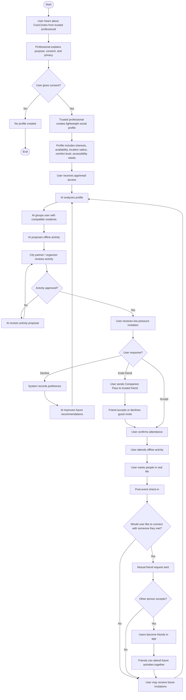
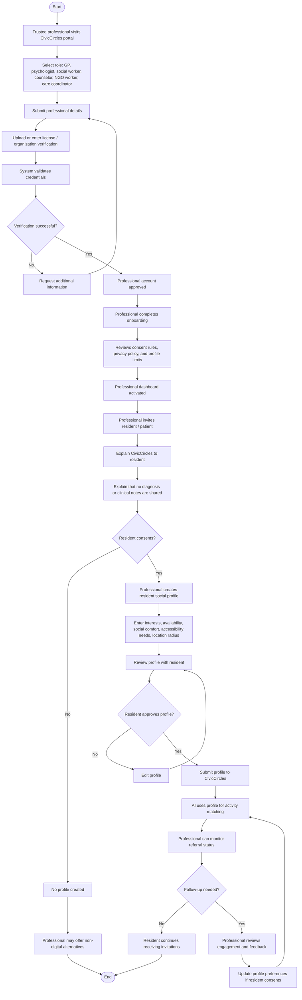
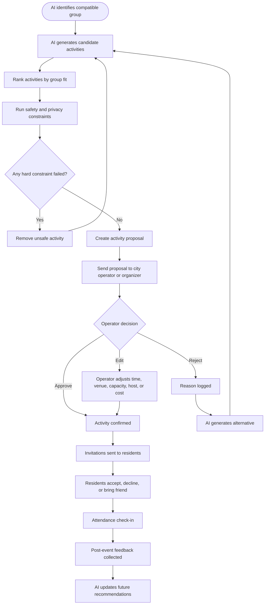

# CivicCircles — Project Specification

**Challenge:** Solve the loneliness epidemic in cities without chatbots.  
**Project type:** 24-hour hackathon prototype  
**Product category:** Social prescribing, civic technology, offline connection platform  
**Core principle:** Minimal user interface, transparent operator intelligence.

**Document status:** Build-ready specification for hackathon and early pilot planning.  
**Primary audience:** Product, design, engineering, and demo/pitch owners.  
**How to use this document:** Build Section 33 first, prove value with Section 36, then align scale-up decisions with Sections 39-41.

---

## 1. Executive Summary

**CivicCircles** is an AI-powered social prescribing platform that helps cities reduce loneliness through small, low-pressure, offline activities.

Unlike social networks, dating apps, event marketplaces, or chatbots, CivicCircles does not ask users to browse people, message strangers, post content, or perform socially. Instead, residents are referred by trusted professionals such as GPs, psychologists, social workers, university counselors, elder-care coordinators, or NGO workers.

With the resident’s explicit consent, the trusted professional creates a lightweight social profile containing interests, availability, location radius, accessibility needs, activity preferences, and social comfort level. The AI then forms small compatible groups and proposes real-world activities such as walks, museum visits, climbing sessions, community gardening, volunteering, board games, photography walks, or coffee meetups.

A city partner or local organizer approves the activity before invitations are sent. Residents receive simple app and email invitations. They can accept, decline, or bring a trusted friend using a **Companion Pass**. Users do not see full attendee information until they arrive and check in at the event location, where **Circle Reveal** unlocks short consent-based attendee cards.

The normal user experience is intentionally minimal: a paper-like city map, a profile icon, and calm invitation cards. The complexity lives in separate professional and city/operator dashboards, where matching, activity recommendations, safety checks, privacy constraints, and AI decision trails can be audited.

---

## 2. One-Sentence Pitch

**CivicCircles helps cities fight loneliness by turning trusted professional referrals into AI-organized, low-pressure offline activities where compatible residents can meet safely.**

---

## 3. Tagline Options

Primary tagline:

> **Social prescribing, powered by AI, without the social network.**

Alternative taglines:

- **Small circles. Real places. Lower pressure.**
- **Connection, prescribed by care and delivered by the city.**
- **Meet people offline, without the pressure of social media.**
- **A social prescription engine for modern cities.**
- **From lonely residents to local circles.**

---

## 4. Problem Statement

Cities are dense with people, but many residents still experience isolation. Existing social platforms often make the problem worse by adding performance pressure, comparison, superficial browsing, rejection, or endless digital interaction.

Many people who are lonely do not need another app to scroll. They need a low-pressure path into real-world social contact.

Common barriers include:

- Not knowing where to start.
- Anxiety around initiating social contact.
- Discomfort with messaging strangers.
- Lack of trust in open social platforms.
- Events that are too large, generic, loud, late, expensive, or intimidating.
- Lack of continuity after one-off events.
- Difficulty finding people with compatible interests and social comfort levels.
- Limited support from existing healthcare and community systems.
- Shame around explicitly joining a “loneliness” group.

CivicCircles solves this by removing the hardest parts: searching, choosing, messaging, and initiating.

---

## 5. Core Insight

The people who most need connection are often the least likely to initiate it themselves.

Therefore, the product should not ask users to behave like power users of a social app. It should create a supportive path from trusted referral to real-world participation.

---

## 6. Product Thesis

CivicCircles should optimize for **repeated, comfortable offline contact**, not screen time.

The goal is not to create a new social network. The goal is to help residents build weak ties, routine, familiarity, and eventually friendship through safe, structured, city-based activities.

---

## 7. What CivicCircles Is Not

CivicCircles is not:

- A chatbot.
- A dating app.
- A social network.
- A friend-swiping app.
- A feed.
- A mental health diagnosis tool.
- A replacement for therapy.
- A public event marketplace.
- A platform for browsing vulnerable people.
- A leaderboard for social success.

---

## 8. What CivicCircles Is

CivicCircles is:

- A consent-based social prescribing platform.
- A city activity coordination system.
- An offline-first matching engine.
- A low-pressure invitation system.
- A human-approved AI recommendation platform.
- A privacy-first bridge between care systems and civic life.
- A tool for professionals and city operators to help residents reconnect.

---

## 9. User Groups

### 9.1 Resident

A resident is a person who may be experiencing loneliness, isolation, social anxiety, low community connection, or difficulty meeting people in the city.

Possible resident profiles:

- Newcomer to the city.
- Remote worker.
- Elderly resident.
- International student.
- Recently divorced person.
- Immigrant.
- Caregiver.
- Person recovering from burnout.
- Person referred by a GP or psychologist.
- Person who wants to reconnect with local community life.

The resident experience must be minimal, non-judgmental, and calming.

### 9.2 Trusted Professional

A trusted professional can refer residents into CivicCircles.

Examples:

- GP / general practitioner.
- Psychologist.
- Therapist.
- Social worker.
- University counselor.
- Elder-care coordinator.
- Community health worker.
- NGO worker.
- Care team member.
- Municipal loneliness prevention worker.

The trusted professional helps the resident understand the product, gives context, collects consent, and creates the resident’s lightweight social profile.

### 9.3 City Operator / Local Organizer

A city operator or local organizer manages activity approval and logistics.

Examples:

- Municipality worker.
- Community center coordinator.
- Library program manager.
- Sports club operator.
- Museum partner.
- Parks department.
- Volunteer coordinator.
- Local business partner.
- NGO operator.

Their role is to review, approve, edit, or reject AI-proposed activities.

### 9.4 Activity Host

A host is the person who anchors an activity in the real world.

They may be:

- A volunteer.
- A city worker.
- A community organizer.
- A venue employee.
- A professional facilitator.
- A trained CivicCircles host.

The host reduces arrival anxiety and makes sure people can find the group.

---

## 10. Core Product Principles

### 10.1 Activity First, People Second, Identity Last

Users should first understand the activity, then the group vibe, and only later the identities of attendees.

This prevents the product from becoming a people-browsing app.

### 10.2 Offline First

Connection begins in the real world, not through online messaging.

### 10.3 Minimal for Residents, Transparent for Operators

The resident UI is intentionally simple. The operator dashboards show the complex matching, safety, approval, and audit logic.

### 10.4 Consent First

Every profile is created through explicit consent. Users can withdraw or pause at any time.

### 10.5 No Clinical Data in Matching

The system should not use diagnoses, therapy notes, medication history, or clinical records.

### 10.6 Human Approval

AI proposes; humans approve.

### 10.7 No Social Ranking of People

The system may rank activity fit or group fit, but it must not rank people’s social value.

### 10.8 Gentle Continuity

After an activity, the system should suggest a natural next step, not random events.

### 10.9 Private Progress, Not Gamification

The system should celebrate effort and courage without public points, leaderboards, social scores, or points for making friends.

### 10.10 Explainability Over Opacity

Every AI recommendation should produce a short human-readable rationale and an auditable structured rationale.

---

## 11. Key Product Concepts

### 11.1 Companion Pass

A user can bring one trusted person to an activity.

Purpose:

- Reduce first-event anxiety.
- Increase attendance.
- Make the first activity feel safer.
- Allow organic growth.

Rules:

- One-time guest link.
- Valid only for that specific activity.
- Guest sees only event logistics.
- Guest does not access the full platform unless they later sign up properly.

### 11.2 Common Ground Preview

Before the event, the resident sees anonymized group-level information.

Example:

- 5 people confirmed.
- Shared interests: photography, parks, coffee.
- Calm pace.
- Small group.
- Host present.

No names or photos are shown yet.

### 11.3 Circle Reveal

When the user has RSVP’d, is within the event time window, is near the meeting point, and actively checks in, the app unlocks short attendee cards.

Each card may include:

- First name.
- Photo or avatar.
- Short bio.
- Common ground.
- Optional conversation starter.

The purpose is to reduce arrival awkwardness without enabling pre-event browsing.

### 11.4 Gentle Continuity

After each activity, CivicCircles recommends the next safest step:

- Repeat a similar activity.
- Join a recurring circle.
- Attend with someone they already met.
- Bring a friend again.
- Try a nearby low-pressure alternative.

### 11.5 30-Second Reflection

A short post-event feedback flow that helps the AI improve recommendations without making users rate each other.

Example questions:

- Did you attend?
- How did you feel afterward?
- Was the activity a good fit?
- Did the group feel comfortable?
- Would you do something similar again?
- Would you like to stay connected with anyone?
- Did anything make you uncomfortable?

---

## 12. User Lifecycle



---

## 13. Trusted Professional Lifecycle



---

## 14. Activity Approval Lifecycle



---

## 15. User Interface Specification

### 15.1 User App Design Direction

The user app should feel like:

- A paper city map.
- A quiet invitation card.
- A civic noticeboard.
- A calm offline companion.

It should not feel like:

- A social network.
- A dating app.
- A productivity dashboard.
- A gamified app.
- A chat app.
- A medical portal.

### 15.2 Visual Style

Recommended style:

- Off-white paper background.
- Thin black or dark-gray linework.
- Muted map tones.
- Soft shadows.
- Rounded cards.
- Minimal icons.
- Calm typography.
- Subtle texture.
- Sparse information density.
- Large tap targets.
- Very few buttons.

### 15.3 Main User Screen

The main screen is a map.

Elements:

- Map background.
- Activity pins.
- Small profile icon.
- Bottom invitation sheet.
- Optional “today” label.
- No feed.
- No inbox.
- No attendee browsing.

Example layout:

```text
------------------------------------------------
|                                              |
|          Minimal paper-like city map          |
|                                              |
|        ○ Activity pin       ○ Activity pin    |
|                                              |
|                                      Profile ○|
|                                              |
|----------------------------------------------|
| You have 2 gentle invitations nearby          |
|                                                |
| Photography Walk                              |
| Saturday · 10:30 · 5 people · Calm pace       |
|                                                |
| Community Garden Visit                        |
| Sunday · 11:00 · 4 people · Hosted            |
------------------------------------------------
```

### 15.4 Activity Invitation Card

Fields:

- Activity title.
- Date and time.
- Location.
- Group size.
- Pace/intensity.
- Host.
- Why it may fit.
- Cost.
- Accessibility note.
- Buttons: Join, Bring a friend, Not this time.

Example:

```text
Photography Walk

Saturday, 10:30–12:00
Vondelpark entrance

Small group: 5 people
Pace: Calm
Host: Anna
Cost: Free
Accessibility: Step-free route

Why this may fit:
Photography · Parks · Coffee · Small groups

[Join] [Bring a friend] [Not this time]
```

### 15.5 Pre-Event Common Ground Preview

Before arrival, show:

- Group size.
- Shared interests.
- Host.
- What to expect.
- Meeting point.
- Arrival instructions.
- Whether attendees are hidden until check-in.

Example:

```text
Your circle is forming

5 people confirmed
Shared interests:
Photography · Parks · Coffee

Attendee cards unlock when you check in at the meeting point.
```

### 15.6 Arrival Check-In

Conditions for check-in:

- User has accepted the activity.
- Current time is within event window, for example 30 minutes before to 30 minutes after start.
- User is within the location radius.
- User taps “Check in.”

Example:

```text
You are close to the meeting point.

Check in to unlock your Circle Reveal.
[Check in]
```

### 15.7 Circle Reveal

After check-in, show short attendee cards.

Example:

```text
Maya

Enjoys film photography, quiet cafés, and city walks.

Common ground:
Photography · Parks

Icebreaker:
Ask me about my favorite photo spot.
```

Rules:

- First name only.
- Photo or avatar is optional.
- No full names.
- No exact age.
- No address.
- No clinical information.
- No referral source.
- No social media links.
- No phone number.
- No private messaging before event.

### 15.8 Post-Event Reflection

A 30-second check-in after the event.

Questions:

1. Did you attend?
   - Yes.
   - No.
   - I tried but could not find the group.
   - I cancelled.
   - Prefer not to say.

2. How did you feel afterward?
   - Better than before.
   - About the same.
   - Worse than before.
   - Not sure.

3. Was this activity a good fit?
   - Yes.
   - Maybe, with changes.
   - No.

4. Did the group feel comfortable?
   - Yes.
   - Somewhat.
   - No.
   - Prefer not to say.

5. Would you do something similar again?
   - Yes.
   - Maybe.
   - No.

6. Would you like to stay connected with anyone you met?
   - Add someone.
   - Maybe later.
   - Not now.

7. Did anything happen that made you uncomfortable?
   - No.
   - Yes, report concern.
   - I want help from a coordinator.

---

## 16. Professional Dashboard Specification

### 16.1 Purpose

The professional dashboard allows trusted professionals to:

- Sign up and verify identity.
- Refer residents.
- Collect consent.
- Create lightweight profiles.
- Monitor high-level engagement.
- Adjust preferences with consent.
- Follow up when needed.

### 16.2 Screens

#### Screen 1: Professional Signup

Fields:

- Name.
- Role.
- Organization.
- License or verification document.
- Email.
- Phone.
- Region/city.
- Consent to platform rules.

#### Screen 2: Verification Pending

Status:

- Submitted.
- Under review.
- Approved.
- Needs more information.
- Rejected.

#### Screen 3: Resident Referral

Fields:

- Resident name.
- Email or phone.
- Preferred language.
- Consent checkbox.
- Explanation completed checkbox.
- Data boundaries acknowledged.

#### Screen 4: Social Profile Builder

Profile fields:

- Interests.
- Preferred activities.
- Availability.
- Location radius.
- Social comfort.
- Group size preference.
- Accessibility needs.
- Languages.
- Cost sensitivity.
- Things to avoid.
- Optional goals.
- Preferred invitation channel.

Explicitly excluded:

- Diagnosis.
- Therapy notes.
- Medication.
- Clinical history.
- Exact home address.
- Income.
- Political views.
- Religious identity unless voluntarily relevant for activity constraints.
- Any sensitive data not needed for matching.

#### Screen 5: Referral Status

Statuses:

- Invited.
- Profile created.
- Waiting for match.
- Activity invitation sent.
- Accepted activity.
- Attended activity.
- Declined recent invitations.
- Requested follow-up.
- Paused.
- Safety concern.

The professional should not see unnecessary details about other attendees.

---

## 17. City / Operator Dashboard Specification

### 17.1 Purpose

The operator dashboard allows city partners to approve AI-generated activity proposals and audit the recommendation process.

### 17.2 Key Dashboards

1. Matching graph.
2. Candidate activity ranking.
3. Match rationale.
4. Safety and privacy audit.
5. Activity approval workflow.
6. Attendance and feedback.
7. Equity monitoring.

---

## 18. Matching Graph Dashboard

### 18.1 Purpose

Visually show how residents are grouped around shared compatibility signals.

### 18.2 Visual Design

Anonymous resident nodes connect to interest, availability, and comfort nodes, which connect to proposed activity nodes.

Example:

```text
Participant A ── photography ──┐
Participant B ── parks ────────┼── Photography Walk
Participant C ── coffee ───────┤
Participant D ── calm pace ────┘
Participant E ── Saturday AM ──┘
```

### 18.3 Node Types

- Participant node.
- Interest node.
- Activity preference node.
- Time availability node.
- Location node.
- Accessibility constraint node.
- Proposed activity node.
- Host node.
- Venue node.

### 18.4 Edge Types

- Shared interest.
- Same availability.
- Compatible location.
- Similar activity intensity.
- Accessibility compatible.
- Prior positive feedback.
- Host availability.
- Venue fit.

---

## 19. Candidate Activity Ranking Dashboard

### 19.1 Purpose

Show that the AI ranks activities by fit, not people.

Example:

```text
Candidate activities for Circle 12

1. Photography Walk — Fit: 92%
2. Museum + Coffee — Fit: 87%
3. Community Garden — Fit: 81%
4. Board Game Café — Fit: 68%
```

### 19.2 Activity Fit Factors

- Shared interests.
- Availability overlap.
- Distance/travel time.
- Group size comfort.
- Activity intensity.
- Cost.
- Accessibility.
- Venue availability.
- Host availability.
- Past feedback.
- Safety constraints.

### 19.3 Do Not Rank

Do not rank:

- Human worth.
- Social desirability.
- Attractiveness.
- Popularity.
- Mental health status.
- Friendship value.

---

## 20. Match Rationale Dashboard

### 20.1 Purpose

Show a human-readable explanation of why a group and activity were recommended.

Example:

```text
Circle 12: Calm Outdoor Creatives

Participants: 5
Recommended activity: Photography Walk
Confidence: High

Shared signals:
- Photography: 4/5
- Parks: 5/5
- Coffee: 3/5
- Saturday morning availability: 5/5
- Small group preference: 5/5

Constraints checked:
- Distance under 20 minutes
- No alcohol preference respected
- Step-free route available
- Host available
- Group size within comfort range
```

### 20.2 Language Guidelines

Use:

- Decision trail.
- Match rationale.
- Explanation layer.
- Constraint report.
- Why this activity.
- Human-readable reasoning summary.

Avoid:

- AI thought process.
- Secret reasoning.
- Social score.
- Ranking people.

---

## 21. Safety and Privacy Audit Dashboard

### 21.1 Checklist

Example:

```text
Safety & Privacy Review

Consent verified: Yes
Clinical data excluded: Yes
Public profiles hidden: Yes
Group size safe: Yes
One-on-one meeting avoided: Yes
Host assigned: Yes
Venue approved: Yes
Accessibility checked: Yes
Alcohol-free preference respected: Yes
Arrival reveal enabled: Yes
```

### 21.2 Data Used

Allowed data:

- Interests.
- Availability.
- Area or approximate location.
- Location radius.
- Social comfort level.
- Group size preference.
- Accessibility needs.
- Preferred language.
- Cost sensitivity.
- Activity feedback.
- Attendance history.
- Host or venue constraints.

### 21.3 Data Not Used

Excluded data:

- Diagnosis.
- Therapy notes.
- Medication.
- Exact home address.
- Income.
- Political views.
- Private messages.
- Full medical record.
- Social media profiles.
- Public popularity metrics.
- Attractiveness or photos for matching.

---

## 22. Activity Proposal and Approval Dashboard

### 22.1 Proposal Card

Example:

```text
Activity Proposal

Title: Calm Photography Walk
Location: Vondelpark
Time: Saturday 10:30
Group size: 5
Host: Anna
Cost: Free
Risk level: Low
Accessibility: Step-free route

[Approve] [Edit] [Reject]
```

### 22.2 Approval States

- Generated.
- Safety checked.
- Venue suggested.
- Host assigned.
- Pending approval.
- Approved.
- Invitations sent.
- Active.
- Completed.
- Feedback collected.
- Archived.

### 22.3 Operator Actions

- Approve.
- Edit time.
- Edit venue.
- Edit capacity.
- Assign host.
- Reject with reason.
- Request alternative.
- Mark venue unavailable.
- Mark safety issue.
- Pause group.

---

## 23. Feedback Learning Dashboard

### 23.1 Purpose

Show how feedback improves future recommendations.

Example:

```text
After activity:

4/5 attended
3/4 felt better afterwards
4/4 would try similar activity
2 mutual connection requests
0 safety reports

AI update:
- Outdoor activities work well for this group
- Saturday morning remains preferred
- Coffee add-on increases attendance
- Keep group size between 4 and 6
```

### 23.2 Positive Signals

- User accepted invitation.
- User attended.
- User completed reflection.
- User felt better afterward.
- User would repeat activity.
- User mutually connected with someone.
- User attended a similar activity later.
- User joined a recurring circle.

### 23.3 Negative Signals

- User declined invitation.
- User cancelled.
- User no-showed.
- User said activity was too far.
- User said activity was too intense.
- User said group was uncomfortable.
- User reported safety issue.
- User repeatedly avoids certain formats.

### 23.4 AI Updates

Possible updates:

- Adjust preferred group size.
- Adjust preferred activity type.
- Reduce travel radius.
- Avoid evening events.
- Increase hosted events.
- Avoid noisy venues.
- Prefer recurring circles.
- Prefer activities with Companion Pass.

---

## 24. Equity Monitor Dashboard

### 24.1 Purpose

Show whether the city is serving residents fairly across neighborhoods, languages, accessibility needs, and cost levels.

### 24.2 Metrics

Example:

```text
Equity Monitor

Neighborhood coverage: Balanced
Free activities: 82%
Step-free activities: 64%
Hosted activities: 71%
Average travel time: 14 minutes
Language-compatible groups: 91%
```

### 24.3 Monitored Dimensions

- Neighborhood coverage.
- Average travel time.
- Free versus paid activities.
- Step-free accessibility.
- Hosted activities.
- Language-compatible groups.
- Age-inclusive activity mix.
- Distribution of activities across city zones.
- Activity availability outside office hours.
- Under-served area detection.

---

## 25. AI System Specification

### 25.1 AI Responsibilities

The AI has four primary roles:

1. Compatibility grouping.
2. Activity generation.
3. Logistics support.
4. Invitation personalization.

### 25.2 Compatibility Grouping

The AI groups residents by:

- Shared interests.
- Similar availability.
- Compatible travel distance.
- Similar activity intensity.
- Similar social comfort.
- Preferred group size.
- Language compatibility.
- Accessibility compatibility.
- Cost sensitivity.
- Past activity feedback.
- Safety constraints.

### 25.3 Activity Generation

The AI proposes activities such as:

- Photography walk.
- Museum visit.
- Community gardening.
- Beginner climbing.
- Library board game evening.
- Dog walk.
- Park walk.
- Coffee after a cultural activity.
- Cooking class.
- Volunteering shift.
- Language exchange.
- Beginner sports session.

### 25.4 Logistics Support

The AI suggests:

- Venue.
- Time.
- Capacity.
- Host requirement.
- Cost.
- Accessibility.
- Meeting point.
- Activity duration.
- Weather suitability.
- Nearby transit.
- Backup plan.

### 25.5 Invitation Personalization

The AI writes reassuring invitation copy.

Example:

```text
This is a calm, small-group activity with people who also enjoy photography and parks. No preparation is needed, and a host will meet everyone at the entrance.
```

### 25.6 AI Must Not

The AI must not:

- Diagnose loneliness.
- Replace therapists.
- Pretend to be a friend.
- Chat emotionally with users.
- Make unsupervised decisions for vulnerable people.
- Reveal sensitive user information.
- Optimize for screen time.
- Rank people socially.
- Encourage excessive dependence on the app.

---

## 26. Matching Algorithm — Conceptual Model

### 26.1 Inputs

Resident profile:

- Interests.
- Activities liked.
- Activities disliked.
- Availability.
- Location radius.
- Social comfort level.
- Group size preference.
- Accessibility needs.
- Language.
- Cost sensitivity.
- Prior attendance.
- Reflection feedback.
- Safety constraints.

Activity catalog:

- Activity type.
- Venue.
- Location.
- Time windows.
- Capacity.
- Cost.
- Accessibility.
- Host availability.
- Risk level.
- Partner approval status.

### 26.2 Hard Constraints

A match should fail if:

- User has not consented.
- Activity violates a stated avoidance preference.
- Venue is inaccessible for a required accessibility need.
- Activity cost exceeds cost sensitivity without subsidy.
- Activity is outside maximum travel radius.
- Activity time conflicts with availability.
- Required language compatibility is not met.
- Group size exceeds comfort range.
- No host is available when host is required.
- Safety risk is too high.

### 26.3 Soft Scoring Factors

Example weights for prototype:

```text
Interest overlap: 25%
Availability overlap: 20%
Distance/travel time: 15%
Social comfort compatibility: 15%
Activity intensity fit: 10%
Past feedback fit: 10%
Diversity and group balance: 5%
```

### 26.4 Activity Fit Score

Activity fit score may be calculated from:

```text
fit_score =
  interest_overlap_score * 0.25 +
  availability_score * 0.20 +
  distance_score * 0.15 +
  comfort_score * 0.15 +
  intensity_score * 0.10 +
  feedback_score * 0.10 +
  group_balance_score * 0.05
```

For hackathon purposes, this can be simulated with deterministic scoring and explanatory output.

### 26.5 Explanation Output

For every recommendation, output:

- Recommended group.
- Recommended activity.
- Top positive signals.
- Hard constraints passed.
- Alternative activities considered.
- Reasons alternatives ranked lower.
- Human approval status.

---

## 27. Data Model

### 27.1 Resident

```json
{
  "id": "resident_123",
  "first_name": "Sofia",
  "email": "sofia@example.com",
  "preferred_language": "English",
  "approx_location": {
    "city": "Amsterdam",
    "neighborhood": "Oud-West"
  },
  "location_radius_km": 3,
  "interests": ["photography", "parks", "coffee", "museums"],
  "activity_preferences": ["walks", "museum visits", "quiet cafes"],
  "availability": ["Saturday morning", "Sunday afternoon"],
  "social_comfort": "small_group_low_pressure",
  "preferred_group_size": {
    "min": 3,
    "max": 6
  },
  "accessibility_needs": ["step_free_route"],
  "cost_sensitivity": "free_or_low_cost",
  "avoid": ["alcohol", "loud venues", "late night"],
  "profile_visibility": {
    "photo": true,
    "first_name": true,
    "short_bio": true,
    "conversation_starter": true
  },
  "status": "active"
}
```

### 27.2 Trusted Professional

```json
{
  "id": "professional_456",
  "name": "Dr. Anna Vermeer",
  "role": "GP",
  "organization": "Oud-West Health Center",
  "verification_status": "approved",
  "city": "Amsterdam",
  "email": "anna@example.com"
}
```

### 27.3 Consent Record

```json
{
  "id": "consent_789",
  "resident_id": "resident_123",
  "professional_id": "professional_456",
  "consent_scope": [
    "create_social_profile",
    "use_profile_for_activity_matching",
    "send_activity_invitations",
    "share_limited_status_with_professional"
  ],
  "created_at": "2026-05-18T10:00:00Z",
  "revoked_at": null
}
```

### 27.4 Activity

```json
{
  "id": "activity_001",
  "title": "Calm Photography Walk",
  "type": "photography_walk",
  "location": {
    "name": "Vondelpark Entrance",
    "address": "Vondelpark, Amsterdam",
    "lat": 52.3579,
    "lng": 4.8686
  },
  "start_time": "2026-05-23T10:30:00+02:00",
  "end_time": "2026-05-23T12:00:00+02:00",
  "capacity": 6,
  "host_id": "host_001",
  "cost": 0,
  "accessibility": ["step_free_route"],
  "risk_level": "low",
  "approval_status": "approved"
}
```

### 27.5 Circle

```json
{
  "id": "circle_012",
  "activity_id": "activity_001",
  "participant_ids": [
    "resident_123",
    "resident_234",
    "resident_345",
    "resident_456",
    "resident_567"
  ],
  "shared_signals": ["photography", "parks", "coffee", "small_group"],
  "fit_score": 0.92,
  "status": "invitations_sent"
}
```

### 27.6 Invitation

```json
{
  "id": "invite_001",
  "resident_id": "resident_123",
  "activity_id": "activity_001",
  "status": "accepted",
  "sent_at": "2026-05-20T09:00:00Z",
  "accepted_at": "2026-05-20T09:15:00Z",
  "companion_pass_used": false
}
```

### 27.7 Feedback

```json
{
  "id": "feedback_001",
  "resident_id": "resident_123",
  "activity_id": "activity_001",
  "attended": true,
  "felt_after": "better",
  "activity_fit": "yes",
  "group_comfort": "yes",
  "would_repeat": true,
  "safety_report": false,
  "notes": null
}
```

---

## 28. API Specification for Prototype

### 28.1 Resident Endpoints

```http
GET /api/resident/me
GET /api/resident/invitations
POST /api/invitations/:id/accept
POST /api/invitations/:id/decline
POST /api/invitations/:id/companion-pass
POST /api/activities/:id/check-in
GET /api/activities/:id/circle-reveal
POST /api/activities/:id/feedback
POST /api/connections/request
```

### 28.2 Professional Endpoints

```http
POST /api/professionals/signup
GET /api/professionals/me
POST /api/residents/referral
POST /api/residents/:id/profile
GET /api/professionals/referrals
PATCH /api/residents/:id/preferences
```

### 28.3 Operator Endpoints

```http
GET /api/operator/proposals
GET /api/operator/proposals/:id
POST /api/operator/proposals/:id/approve
POST /api/operator/proposals/:id/reject
PATCH /api/operator/proposals/:id
GET /api/operator/matching-graph/:circleId
GET /api/operator/audit/:activityId
GET /api/operator/equity
```

### 28.4 AI Endpoints

```http
POST /api/ai/generate-circles
POST /api/ai/rank-activities
POST /api/ai/generate-activity-proposal
POST /api/ai/explain-match
POST /api/ai/update-preferences-from-feedback
```

### 28.5 API Contract Conventions (Prototype)

Use a consistent response envelope for all endpoints:

```json
{
  "ok": true,
  "data": {},
  "error": null,
  "meta": {
    "request_id": "req_123",
    "timestamp": "2026-05-18T16:20:00Z"
  }
}
```

Guidelines:

- Use deterministic mock IDs for demo stability.
- Return clear user-safe error messages in `error.message`.
- Include `reason_code` for operator and dashboard actions.
- Log decision inputs/outputs for every AI endpoint.
- Keep PII out of logs by default.

---

## 29. Permission and Privacy Model

### 29.1 User Consent Scopes

Potential consent scopes:

- Create lightweight social profile.
- Use profile for offline activity matching.
- Send app and email invitations.
- Share limited engagement status with referring professional.
- Share first name and short profile card after event check-in.
- Use post-event feedback to improve recommendations.
- Allow mutual friend connection after attending the same activity.

### 29.2 Resident Visibility Rules

Before RSVP:

- No attendee identities shown.

After RSVP:

- Anonymous group preview shown.

Near location and checked in:

- Short attendee cards revealed.

After event:

- Attendees visible only for connection request and safety reporting.

After mutual connection:

- Slightly richer friend profile can be shown.

### 29.3 Professional Visibility Rules

Professional may see:

- Referral status.
- Whether resident has joined platform.
- Whether invitations were sent.
- Whether resident accepted or attended.
- Whether resident requested follow-up.
- Whether safety issue needs attention.

Professional should not see:

- Names of other attendees.
- Private feedback about other attendees.
- Full friend graph.
- Detailed event-by-event emotional feedback unless explicitly consented.
- Clinical inferences generated by AI.

### 29.4 Operator Visibility Rules

Operators may see:

- Anonymous participant IDs.
- Group-level match rationale.
- Activity proposal details.
- Safety and logistics constraints.
- Attendance aggregate.
- Feedback aggregate.
- Incident alerts when relevant.

Operators should not see:

- Clinical data.
- Full medical history.
- Exact home addresses.
- Sensitive unnecessary demographics.
- Private notes from professionals.

---

## 30. Safety Model

### 30.1 Default Safety Choices

- Group activities by default.
- Avoid one-on-one matching.
- Require human approval.
- Prefer public venues.
- Use hosts for vulnerable groups.
- Reveal attendee identity only at arrival.
- Limit profile information.
- No public browsing.
- No cold messaging.
- No pre-event direct messages.
- Post-event mutual connection only.
- Reporting always available.

### 30.2 Report Types

- Harassment.
- No-show by host.
- Could not find group.
- Felt unsafe.
- Accessibility issue.
- Venue problem.
- Participant behavior concern.
- Medical or urgent concern.
- Other.

### 30.3 Escalation Levels

Level 1: Minor issue  
Examples: unclear meeting point, event too noisy.  
Action: Improve logistics.

Level 2: Comfort issue  
Examples: group felt awkward, too intense, too large.  
Action: Adjust matching preferences.

Level 3: Safety issue  
Examples: harassment, threatening behavior.  
Action: Notify operator, hide user from future matching with reported person, investigate.

Level 4: Urgent issue  
Examples: immediate danger.  
Action: Emergency guidance, operator escalation, follow local safety protocol.

---

## 31. Retention Strategy

### 31.1 What Retention Means

Retention does not mean screen time. Retention means residents continue to participate in comfortable offline activities.

### 31.2 Retention Mechanics

Use:

- Companion Pass.
- Gentle reminders.
- Clear expectations.
- Similar next activity.
- Recurring circles.
- Familiar faces.
- Low-pressure invitations.
- Private progress markers.
- Professional follow-up when consented.
- 30-second reflections.

Avoid:

- Streak pressure.
- Leaderboards.
- Points for making friends.
- Public achievements.
- Social comparison.
- Shame-based no-show messages.
- Addiction mechanics.

### 31.3 Private Progress Markers

Examples:

- First invitation accepted.
- First activity attended.
- Tried something new.
- Returned to a similar activity.
- Joined a recurring circle.
- Saw a familiar face.
- Completed a reflection.

Suggested copy:

```text
You showed up today. That counts.
```

---

## 32. Gamification Position

CivicCircles should use private progress, not traditional gamification.

Do not award points for:

- Making friends.
- Number of people met.
- Being rated positively.
- Social popularity.
- Never cancelling.
- Attending while anxious.

If a points-like system is used, call it **Connection Steps** and reward effort:

- Accepting an invitation.
- Attending.
- Completing reflection.
- Trying a new activity type.
- Returning to a circle.

Recommended principle:

> No points for friendship. No leaderboards. No streak pressure. Only private progress markers that celebrate effort, comfort, and repeated offline participation.

---

## 33. Hackathon MVP Scope

### 33.1 Must Build

For a 24-hour hackathon, build a convincing prototype with:

1. Minimal user map screen.
2. Activity invitation card.
3. RSVP flow.
4. Circle Reveal unlock screen.
5. Post-event reflection screen.
6. Professional profile creation dashboard.
7. Operator matching graph dashboard.
8. Activity ranking dashboard.
9. Safety and privacy audit checklist.
10. Activity approval screen.
11. Demo data for one persona and one activity.

### 33.2 Should Build

If time allows:

- Companion Pass flow.
- Feedback learning dashboard.
- Equity monitor.
- Host check-in view.
- Email invitation mock.
- Recurring circle recommendation.

### 33.3 Do Not Build

Do not build:

- Real authentication.
- Real license verification.
- Real government booking.
- Real payments.
- Full chat system.
- Public profiles.
- Real geofencing unless easy.
- Complex production matching.
- Long onboarding.
- Full medical compliance infrastructure.

Simulate complex backend logic with mock data and deterministic scoring.

### 33.4 MVP Demo Acceptance Checklist

The hackathon MVP is complete when all of the following are true:

- A resident can view at least 2 invitations and RSVP.
- Circle Reveal unlocks only after simulated check-in.
- A professional can create one referral profile end-to-end.
- An operator can approve or reject one AI activity proposal.
- The activity ranking view explains why the top option won.
- The safety/privacy audit view shows at least 5 checks.
- Post-event reflection is captured and affects the next recommendation.
- The full demo script in Section 36 runs without manual improvisation.

---

## 34. Suggested Tech Stack

### 34.1 Frontend

Recommended:

- React or Next.js.
- Tailwind CSS.
- Framer Motion for animations.
- Mapbox, Leaflet, or a static stylized map.
- Recharts or D3 for dashboard visuals.
- shadcn/ui for clean dashboard components.

### 34.2 Backend

Recommended for hackathon:

- Node.js / Express or Next.js API routes.
- Python FastAPI if the team is more comfortable with Python.
- Supabase or Firebase for quick persistence.
- Static JSON mock data if time is short.

### 34.3 AI Layer

For prototype:

- Use scripted mock AI outputs.
- Optionally use an LLM for invitation copy and match explanations.
- Use deterministic scoring for activity ranking.
- Generate an auditable explanation object.

### 34.4 Data Storage

For hackathon:

- JSON files.
- SQLite.
- Supabase tables.
- Firebase documents.

### 34.5 Maps

Options:

- Use a stylized static SVG map for visual polish.
- Use Mapbox if the team already knows it.
- Use Leaflet for simplicity.
- Fake geofence check-in with a button: “Simulate arrival.”

---

## 35. Demo Persona

### 35.1 Sofia

Sofia is 29, moved to Amsterdam six months ago, works remotely, and has been feeling isolated. She tells her GP that she wants to meet people but does not want dating apps, social media, or large events.

Her GP offers CivicCircles.

Sofia consents.

Profile:

- Interests: photography, parks, coffee, museums.
- Availability: Saturday mornings.
- Comfort: small groups, calm settings.
- Avoid: alcohol, loud venues, late nights.
- Accessibility: step-free routes.
- Location radius: 3 km.
- Companion Pass: allowed.

AI groups Sofia with four other residents and proposes a calm photography walk.

City operator approves the activity.

Sofia receives a simple invitation, accepts, and later unlocks Circle Reveal when she arrives.

After the activity, she reports feeling better and says she would do something similar again.

The system recommends a community garden visit with a similar group next week.

---

## 36. Hackathon Demo Script

### Scene 1: User Map

Show Sofia’s minimal map.

Narration:

> This is the resident experience. No feed, no chat, no social pressure. Just a calm city map with a few invitations.

### Scene 2: Invitation

Open the Photography Walk card.

Narration:

> Sofia does not need to browse strangers or start a conversation. She sees what the activity is, why it fits, and that a host will be there.

### Scene 3: Professional Dashboard

Show the profile created by Sofia’s GP.

Narration:

> CivicCircles starts from trusted referrals. The professional creates a lightweight profile with consent. No diagnosis or clinical notes are used.

### Scene 4: Matching Graph

Show operator dashboard with anonymous nodes.

Narration:

> Behind the scenes, the AI forms small groups around compatibility signals such as interests, availability, comfort level, accessibility, and distance.

### Scene 5: Activity Ranking

Show candidate activities and scores.

Narration:

> The AI ranks activities by fit. It does not rank people. Here, the photography walk wins because all five participants share Saturday morning availability, calm outdoor preferences, and nearby location.

### Scene 6: Safety Audit

Show checklist.

Narration:

> Every recommendation includes an audit trail: consent verified, clinical data excluded, group size safe, host assigned, accessibility checked, and venue approved.

### Scene 7: City Approval

Operator approves the activity.

Narration:

> AI proposes; humans approve. CivicCircles coordinates with city partners and local organizers.

### Scene 8: Circle Reveal

Back to user app. Sofia arrives and checks in.

Narration:

> Attendee cards only unlock at arrival after check-in. This reduces anxiety without turning the product into a social network.

### Scene 9: Feedback Loop

Show post-event reflection and dashboard update.

Narration:

> After the event, Sofia completes a 30-second reflection. The system learns that calm outdoor activities work well and suggests a similar next step.

### Closing

> CivicCircles does not optimize for screen time. It optimizes for repeated, comfortable offline contact.

---

## 37. Pitch Deck Structure

### Slide 1: Problem

Cities are crowded, but people are lonely. Existing social apps often increase pressure.

### Slide 2: Insight

The people who need connection most are often least likely to initiate it themselves.

### Slide 3: Solution

CivicCircles: professionally supported, AI-organized, offline micro-activities.

### Slide 4: User Journey

Trusted professional referral → consent profile → AI group → city approval → low-pressure invitation → offline activity → reflection → next step.

### Slide 5: User Interface

Minimal paper-like map. No feed. No chatbot. No public profiles.

### Slide 6: AI and Matching

Compatibility graph, activity ranking, and explainable decision trail.

### Slide 7: Safety and Privacy

Consent, minimal data, no clinical notes, human approval, group-first meetings, Circle Reveal.

### Slide 8: Retention

Gentle Continuity, Companion Pass, familiar faces, recurring circles.

### Slide 9: Impact

More residents participate in local activities and build repeated offline contact.

### Slide 10: Vision

A city where care systems, community spaces, and civic infrastructure actively help residents reconnect.

---

## 38. Judge-Friendly Talking Points

Use these exact lines:

> CivicCircles is not a social network. It is a social prescribing engine.

> The user does not browse people. The city helps them receive the right invitation at the right time.

> The AI ranks activity fit, not human worth.

> Every recommendation has an auditable decision trail.

> We deliberately keep the resident UI minimal because loneliness is not solved by more screen time.

> Connection starts offline, but the app makes the first moment less scary.

> AI proposes, humans approve.

> We do not reward people for making friends. We support the courage to show up.

---

## 39. Success Metrics

### 39.1 User-Level Metrics

- Invitation acceptance rate.
- Attendance rate.
- Repeat attendance rate.
- Reflection completion rate.
- Percentage who felt better afterward.
- Percentage who would repeat similar activity.
- Companion Pass usage.
- Mutual connection rate.
- Recurring circle join rate.
- Safety reports per activity.
- No-show rate.

### 39.2 Professional Metrics

- Number of referrals.
- Consent completion rate.
- Profile completion rate.
- Residents with first activity invitation.
- Residents who attended at least one activity.
- Residents needing follow-up.

### 39.3 City Metrics

- Approved activities.
- Activity fill rate.
- Venue utilization.
- Neighborhood coverage.
- Free activity availability.
- Accessibility coverage.
- Average travel distance.
- Hosted activity percentage.
- Repeat activity success.

### 39.4 North Star Metric

Recommended:

> Number of residents who attend at least two comfortable offline activities within 30 days.

This captures repeated offline contact without turning friendship into a metric.

---

## 40. Risks and Mitigations

### Risk: Product feels like a dating app

Mitigation:

- No swiping.
- No public profiles.
- No attractiveness-based browsing.
- Activity-first design.
- Group events by default.

### Risk: Users feel socially scored

Mitigation:

- No social score.
- No points for making friends.
- No leaderboard.
- Private progress only.

### Risk: Privacy concerns

Mitigation:

- Explicit consent.
- Minimal data.
- No clinical notes.
- Arrival-only reveal.
- Transparent audit dashboard.
- Data not used list.

### Risk: AI makes unsafe recommendations

Mitigation:

- Hard constraints.
- Safety audit.
- Human approval.
- Host assignment.
- Public venues.
- Incident reporting.

### Risk: Low attendance

Mitigation:

- Companion Pass.
- Anxiety-reducing reminders.
- Clear expectations.
- Soft confirmation.
- Small familiar groups.
- Similar next activity.

### Risk: Feedback feels like rating people

Mitigation:

- Ask about activity and group comfort.
- Do not score individuals.
- Separate safety reporting from social feedback.
- Allow “prefer not to say.”

---

## 41. Future Roadmap

### Phase 1: Hackathon Prototype

- Mock user app.
- Mock dashboards.
- Demo data.
- Simulated AI matching.
- Simulated check-in.

### Phase 2: Pilot with One Organization

- One city district.
- One trusted referral partner.
- One set of approved venues.
- Small number of activity types.
- Manual approval.

### Phase 3: City Pilot

- Multiple referral partners.
- Venue inventory.
- Hosts.
- Real attendance tracking.
- Safety process.
- Feedback loop.

### Phase 4: Civic Infrastructure

- Integration with city activity calendars.
- Social prescribing networks.
- Health and community organizations.
- Accessibility databases.
- Subsidized activity funding.
- Longitudinal impact measurement.

---

## 42. Final Product Definition

CivicCircles is a privacy-first, offline-first social prescribing platform for cities.

Residents receive low-pressure invitations to small real-world activities based on consent-based profiles created with trusted professionals. AI forms compatible groups, proposes activities, and explains its recommendations through auditable decision trails. City operators approve activities, hosts anchor the real-world experience, and users only reveal limited attendee information when they arrive and check in.

The resident experience is intentionally minimal: a quiet map, simple invitations, and post-event reflection. The operator experience is transparent and powerful: matching graphs, safety checks, activity rankings, and feedback learning loops.

CivicCircles does not try to make lonely people spend more time online. It helps them take the next safe step into the city.

---

## 43. Recommended Build Priorities for the Team

If time is extremely limited, build in this order:

1. User map with invitation card.
2. Circle Reveal animation.
3. Matching graph dashboard.
4. Activity ranking dashboard.
5. Safety audit checklist.
6. Professional profile creation screen.
7. Feedback reflection screen.
8. Demo script and fake data.

The most judge-impressive combination is:

- Minimal paper-like user app.
- Rich transparent audit dashboard.
- Clear safety/privacy logic.
- Strong demo persona.
- Circle Reveal moment.
